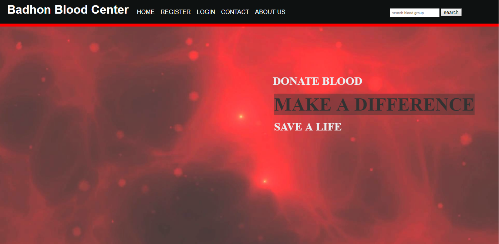
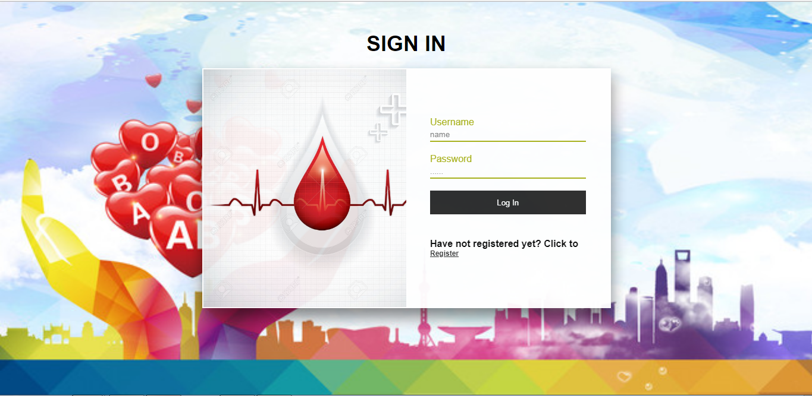
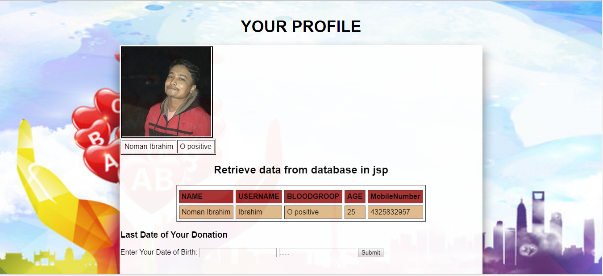
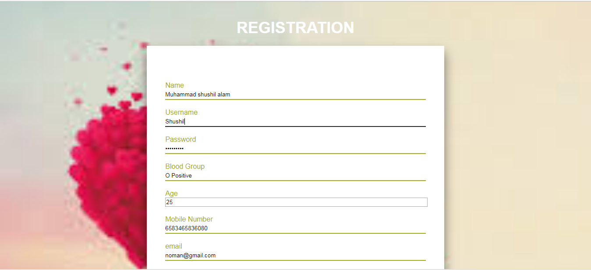

# Screen Shots
  
  
  
  
  
  
  
  

# Project Title
DOCTOR'S HOUSE

## Description

Java Servlet and JSP based Web-App. User Must be logged in as a Blood Donor. He/She will be listed as a potential blood donor. After
Logging in a unique profile will be generated. During registration, a Donar must give his/her mobile number and email. Other users and outsider can search through the database and request for blood donation. (Basic CRUDE operation).

 
 
# Technology I have used
  ### Front End
     * jsp. 
     * HTML, CSS
     
  ### Back End
     * java
  
  ### Database
     * MySql
     * H2 database engine.
     * JDBC
  ### IDE
     * eclipse.

  ### Version control
     * GitHub
  ### Server
     * Apache Tomcat (7)
     
  
